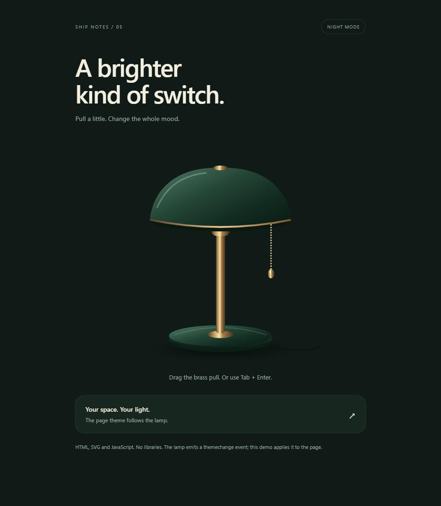

# Ship Notes components

Small interfaces with moving parts, built for [Ship Notes](https://x.com/shipnotesai). New components are added as their videos come out.

## Pull Lamp

A desk lamp that switches the page between light and dark themes. Pull the brass cord, tap it, or use the keyboard.

**[Try it live](https://aqualang89.github.io/shipnotes-components/components/pull-lamp/demo.html)**, works on a phone too.

### Download and try

1. [Download the ZIP](https://github.com/aqualang89/shipnotes-components/archive/refs/heads/main.zip), or use **Code > Download ZIP** above.
2. Extract the ZIP to a folder on your computer.
3. Open `components/pull-lamp/demo.html` in your browser. Keep `pull-lamp.js` beside it.

No account, package install or build step. The demo works locally without a server. GitHub displays the source; opening the HTML file after extraction runs the demo.

### Add it to your site

Follow the [Pull Lamp instructions](components/pull-lamp/README.md) for a complete HTML example. Copy one JavaScript file and connect its `themechange` event to your page's colors. The SVG illustration is included in the component. No runtime libraries or image downloads.

Mouse, touch, keyboard and reduced motion are supported. Tested in Chromium on desktop and at a 390px mobile viewport. Safari, Firefox and physical phones have not been tested in this release check.

## Follow the builds

[Ship Notes on X](https://x.com/shipnotesai). Follow along for the next component and its source.

## License

The code is [MIT licensed](LICENSE). Use it in personal or commercial projects, modify it, and keep the license notice when redistributing it.
