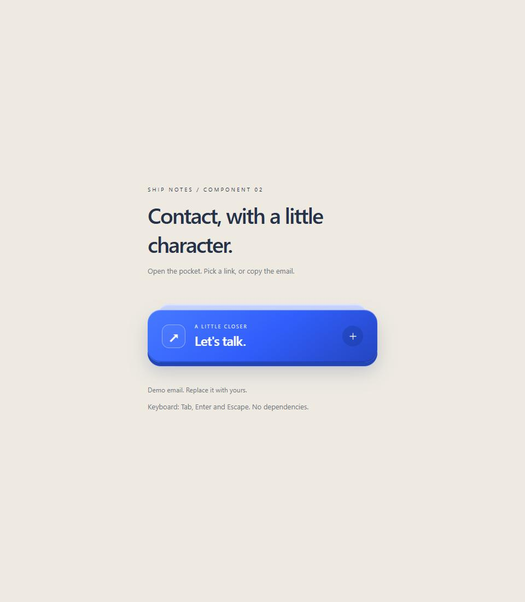
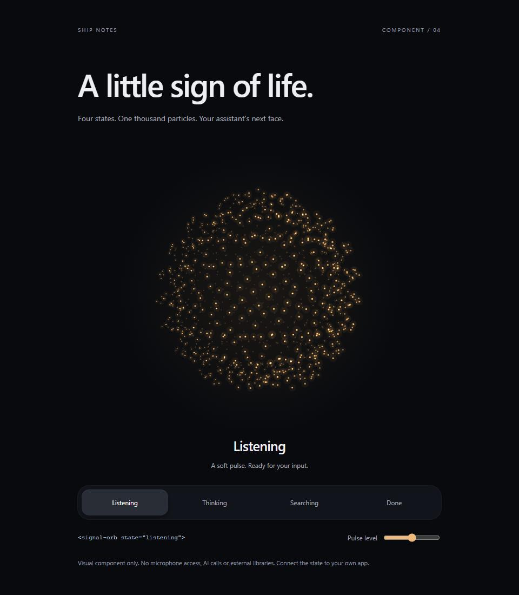
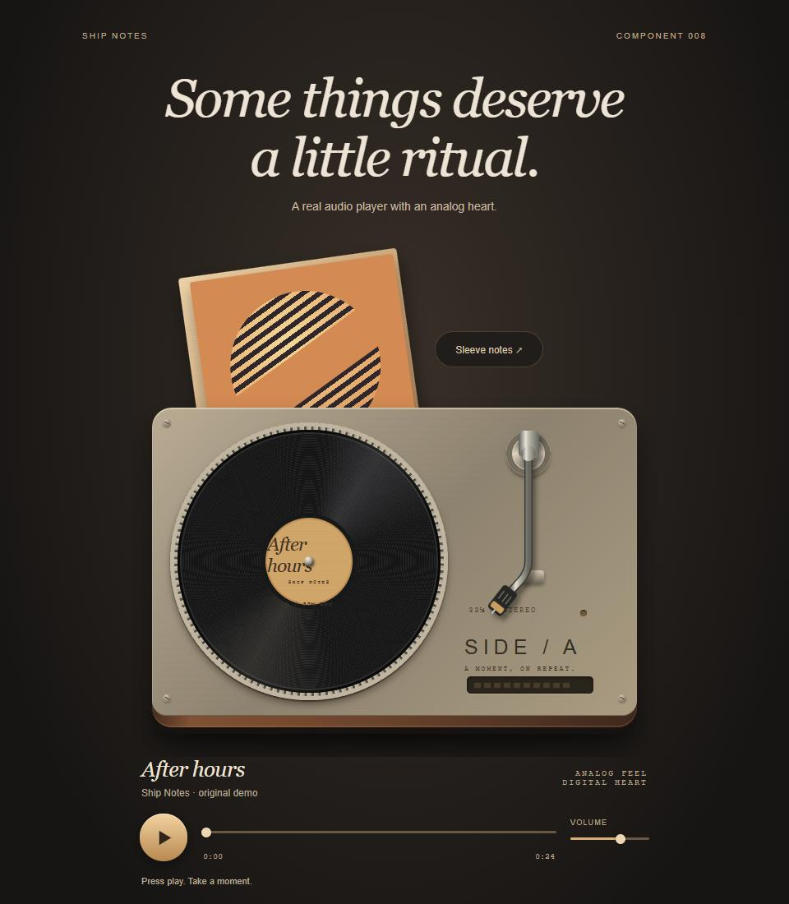
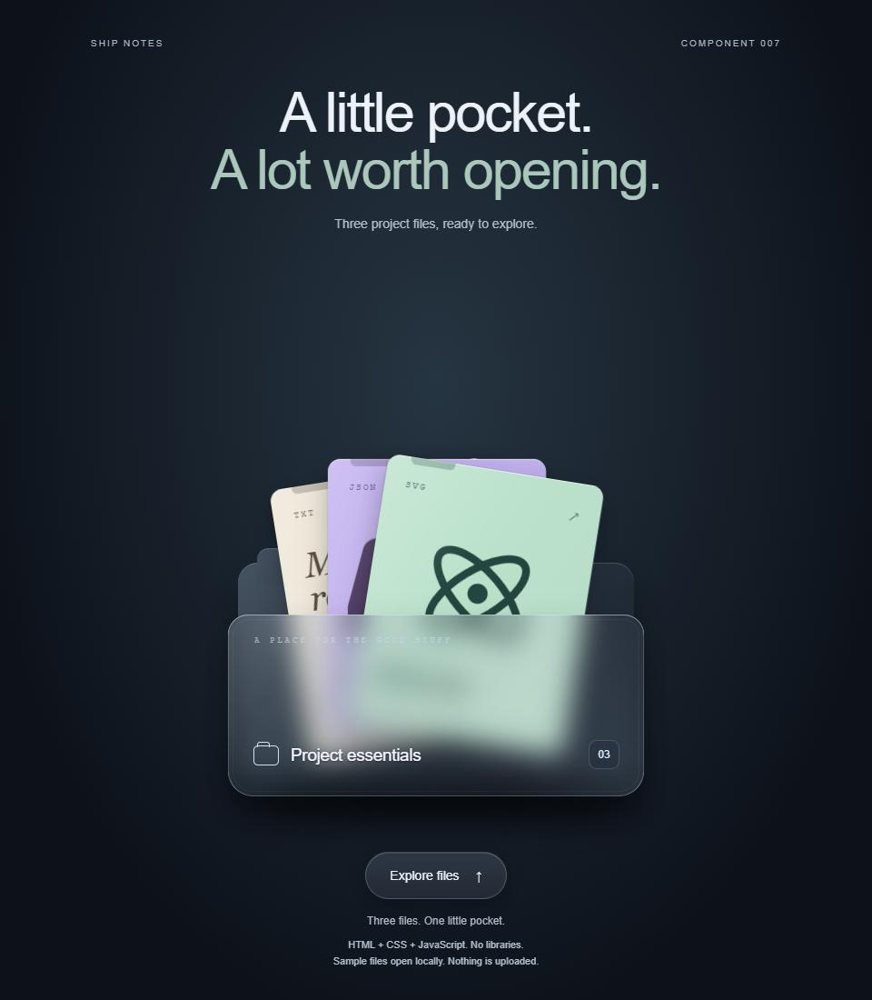
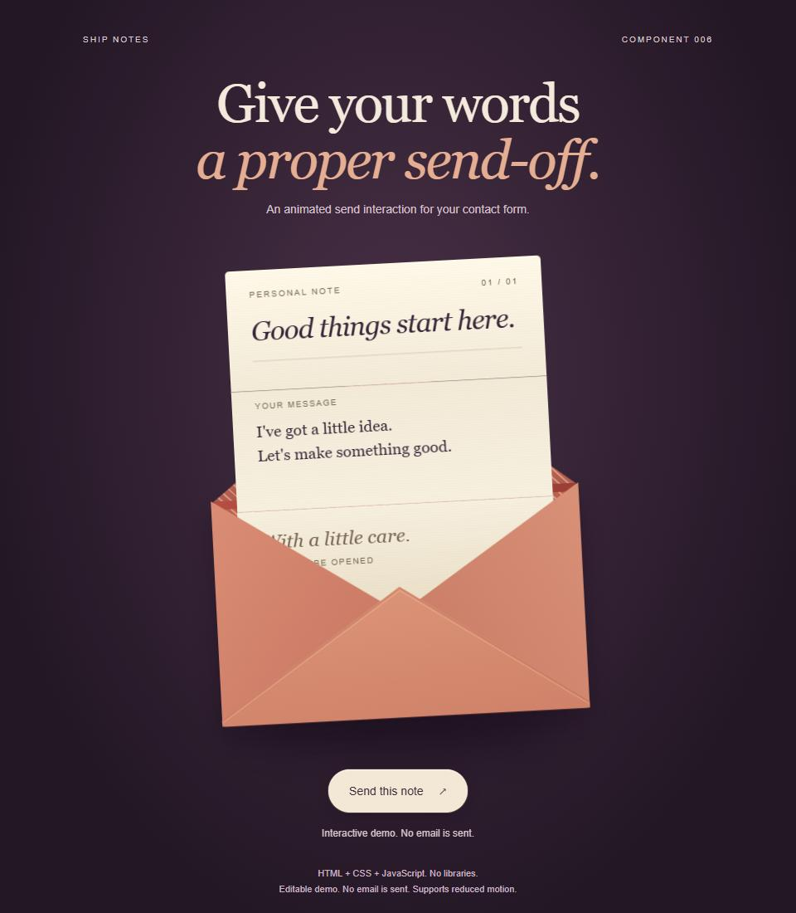
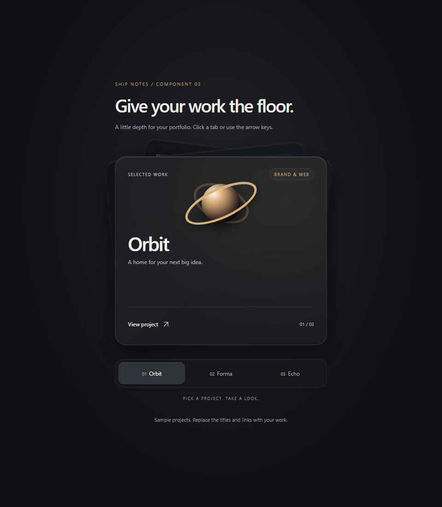
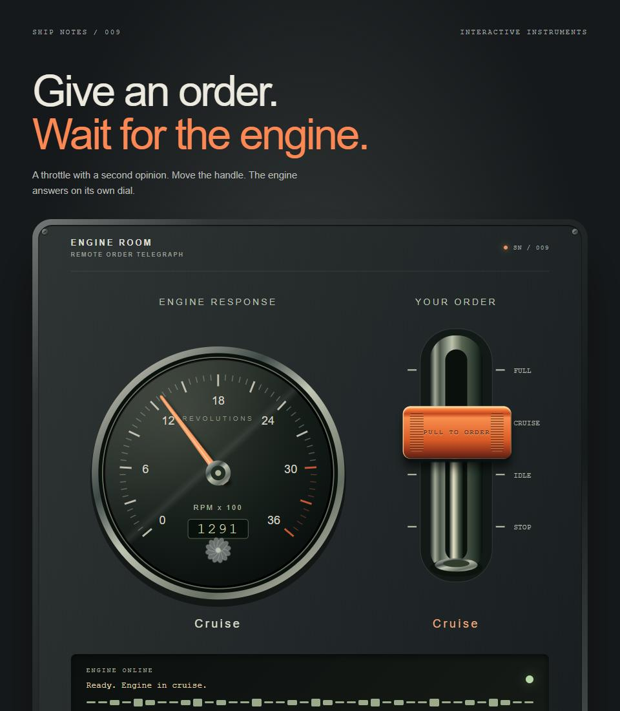
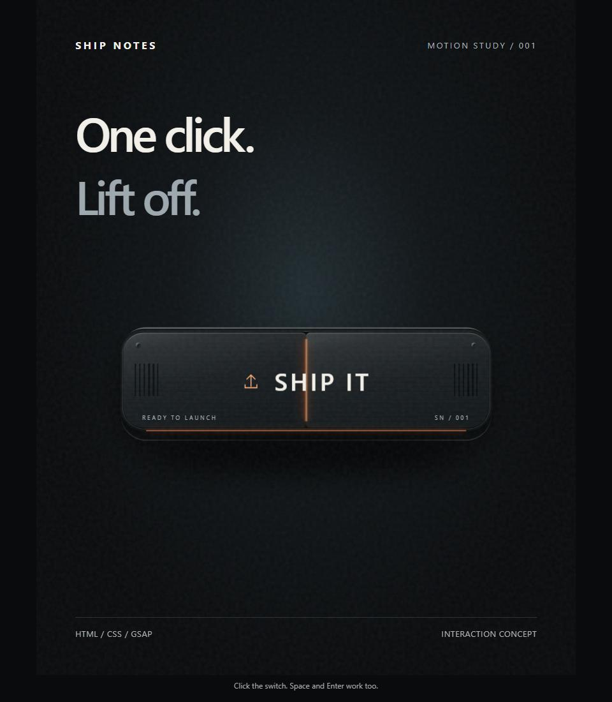

# Ship Notes components

Small interfaces with moving parts. A lamp that switches your theme, a record player that plays audio, a note that folds into an envelope.

Each folder has a working browser demo and the code to use it. Download this repository with **Code > Download ZIP**, unzip it, then open a component's `demo.html`. No package install or build step.

## Pick a component

| Preview | Component | What it does |
| --- | --- | --- |
|  | [Pull Lamp](components/pull-lamp) | Pull the cord to switch the theme. |
|  | [Contact Pocket](components/contact-pocket) | A contact card with links and email copying. |
|  | [Signal Orb](components/signal-orb) | Listening, thinking, searching and done, drawn with particles. |
|  | [Side A](components/side-a) | A record player with real audio, seeking and volume. |
|  | [Pocket Files](components/pocket-files) | A file dock with expanding previews. |
|  | [Postmark](components/postmark) | A send interaction that folds and seals a paper note. |
|  | [Project Stack](components/project-stack) | Three project cards for a small portfolio. |
|  | [Engine Room](components/engine-room) | A throttle that separates a request from its confirmation. |
|  | [Launch Switch](components/launch-switch) | A mechanical button animation. Visual demo, not a deploy tool. |

## Use the code

Start with the README inside the component folder. Most examples are standalone Web Components with scoped styles. Copy the component script, load it with a `<script>` tag, and use its custom element. Replace demo links and content with your own.

Eight components need no runtime library. Launch Switch contains GSAP, with its own license notice preserved. These are HTML, CSS, JavaScript, SVG and Canvas experiments, not a pure-CSS collection.

The demos are front-end examples. Postmark does not send mail by itself, Signal Orb does not call an AI service, and Engine Room has no hardware connection. Each README explains what is real and what is simulated. Reduced-motion and keyboard support vary by component; read its notes before integrating. Chromium has been tested; comprehensive cross-browser testing has not.

## Follow the builds

[Ship Notes on X](https://x.com/shipnotesai). Existing gist links remain available; this repository is the shared catalog for new updates.

## License

Our code is [MIT licensed](LICENSE). Use it in personal or commercial projects, modify it, and keep the license notice when redistributing it. Embedded third-party code keeps its own terms; see [THIRD_PARTY.md](THIRD_PARTY.md).
