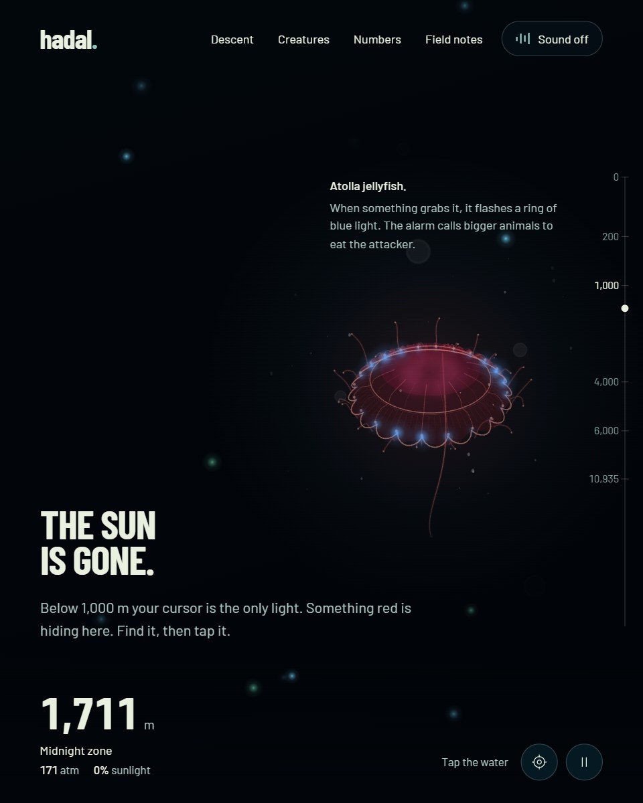
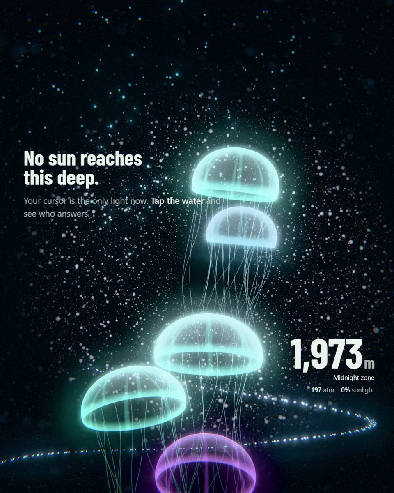
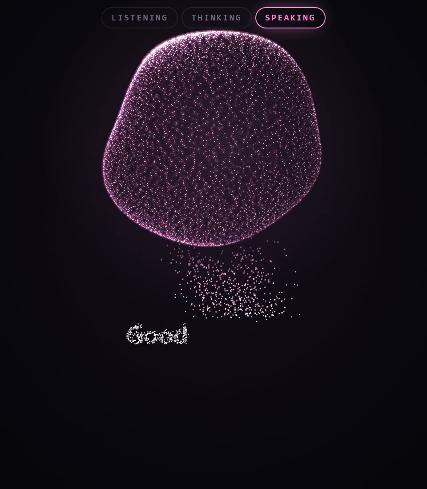
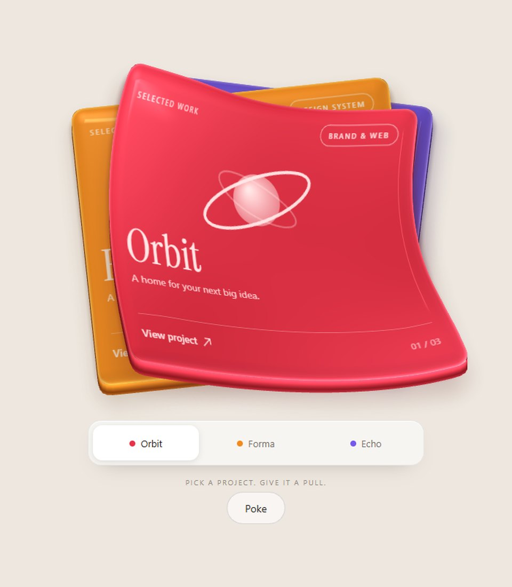
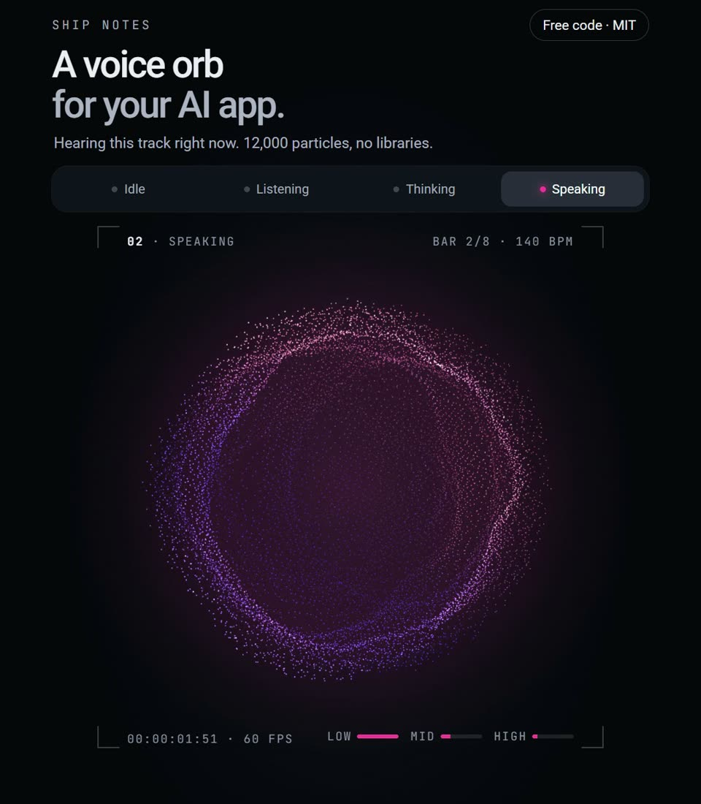
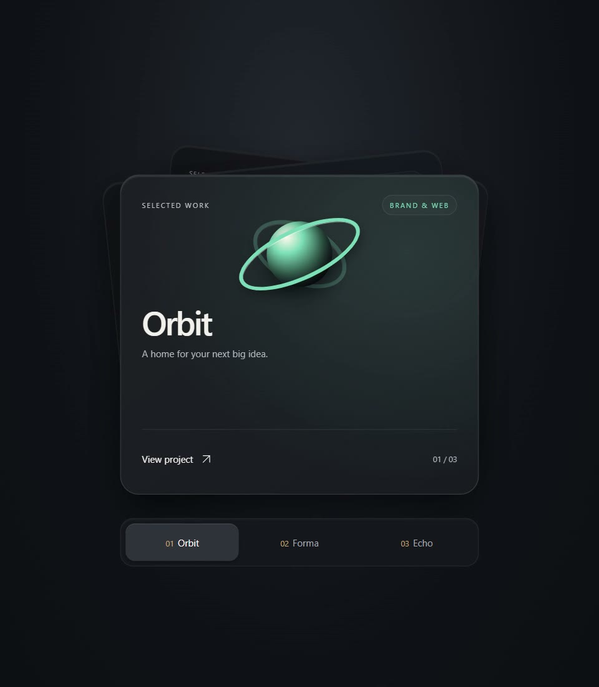
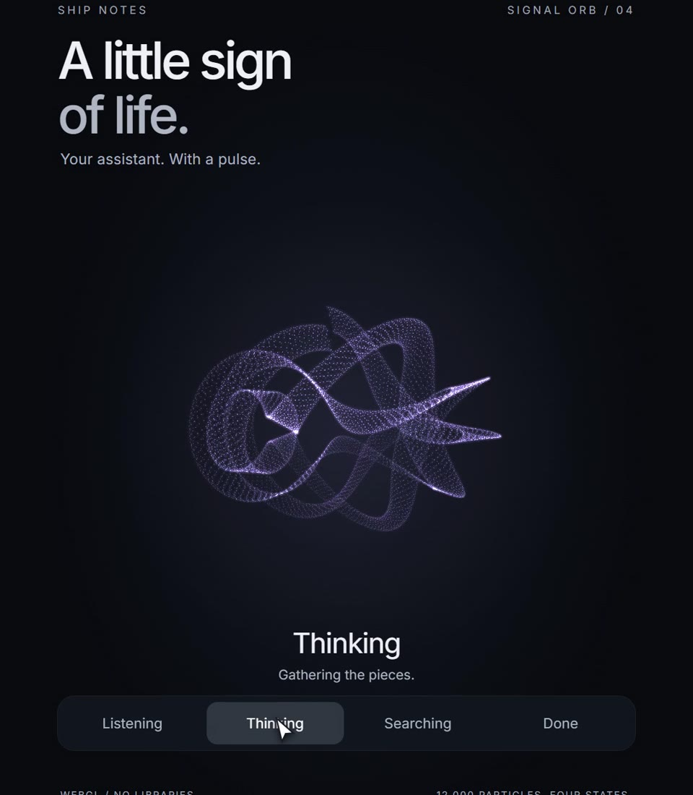
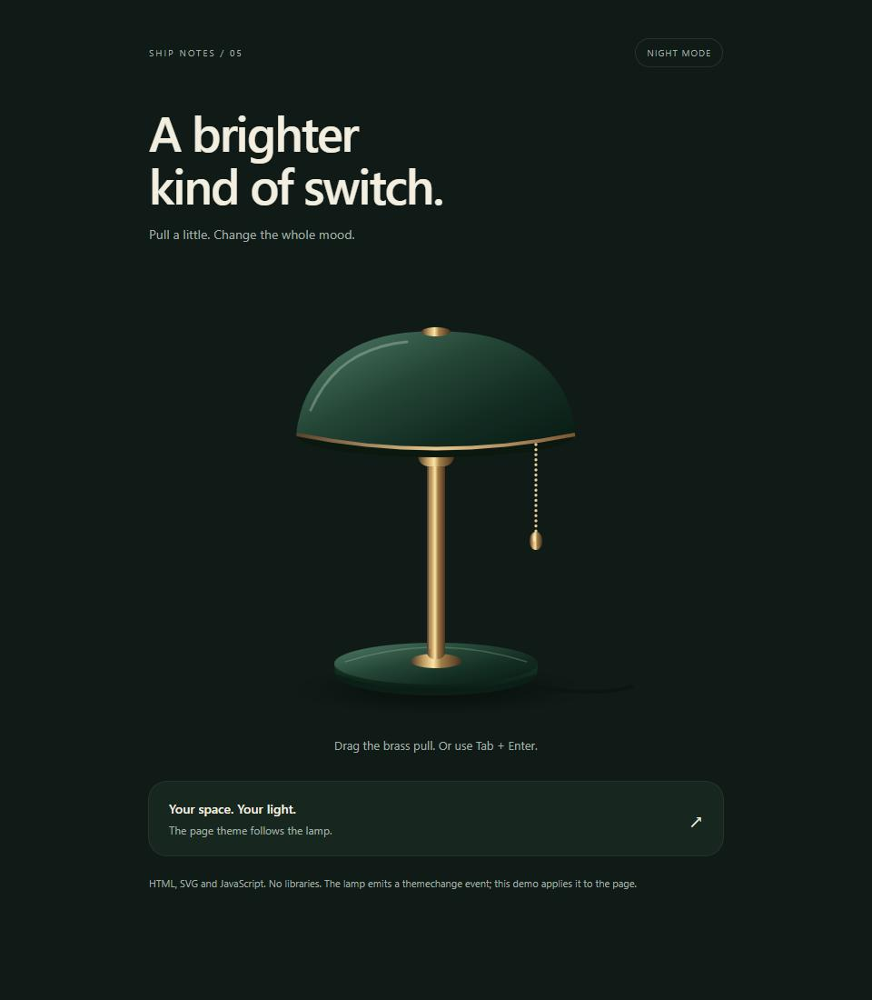

# Ship Notes components

Small interfaces with moving parts, built for [Ship Notes](https://x.com/shipnotesai). New components are added as their videos come out.

Want one built for your product? [DM me on X](https://x.com/shipnotesai).

## Hadal: the expedition (a world)

A made-up expedition to the bottom of the Mariana Trench. Red goes first, even the buttons lose it. Below 1,000 m your cursor is the only light: find the red jellyfish, tap it and see what answers its alarm. A beaked whale lit by plankton, an anglerfish, the last fish at 8,336 m, a lander on the floor at 10,935 m.

**[Dive in live](https://aqualang89.github.io/shipnotes-components/worlds/hadal-expedition/)**, sound on. How it works in the [expedition notes](worlds/hadal-expedition/README.md). No libraries, no images: every animal is lines on one canvas, every sound synthesized in the browser.

## Hadal (a world)

Scroll to the bottom of the ocean, 10,935 m down. The water takes the colors the way real water does, a red can turns black by 20 m, and below 1,000 m your cursor is the only light. Tap the water and the jellyfish flash back. Everest is drawn to scale at the bottom.

**[Dive in live](https://aqualang89.github.io/shipnotes-components/worlds/hadal/)**, sound on. How it works in the [Hadal notes](worlds/hadal/README.md). One index.html, Three.js in the folder, every sound synthesized in the browser.

## Speaking Orb

A face for your voice assistant. The orb talks: it swells with the voice, and every word flies out of it as particles and lands as a live caption. Listening, thinking, searching, speaking and done. One line makes it speak with the browser's own voice, or plug in your TTS audio and it follows the real sound.

**[Try it live](https://aqualang89.github.io/shipnotes-components/components/speaking-orb/demo.html)**. Tap a line and it speaks. Full usage in the [Speaking Orb instructions](components/speaking-orb/README.md). One JavaScript file, no libraries, no keys, nothing leaves the page.

## Jelly Stack

Project Stack, but the three cards are jelly. Pull a corner and it stretches, flick it and it whips, tap the card behind and it hops out and splats. Each card is 81 points on springs, and the text bends with the surface.

**[Try it live](https://aqualang89.github.io/shipnotes-components/components/jelly-stack/demo.html)**. Full usage in the [Jelly Stack instructions](components/jelly-stack/README.md). One JavaScript file, no libraries, WebGL with a plain CSS fallback.

## Voice Orb

A voice orb for an AI app: 12,000 particles on WebGL that react to live sound from a mic or anything playing on the page. Bass moves the whole sphere, and the highs throw sparks off the edge. Four states: idle, listening, thinking and speaking.

**[Try it live](https://aqualang89.github.io/shipnotes-components/components/voice-orb/demo.html)**. Tap Play beat, or Talk to it for the mic. Full usage in the [Voice Orb instructions](components/voice-orb/README.md). One JavaScript file, no libraries, and the audio never leaves your browser.

## Project Stack

Three portfolio cards in a stack. Pick a tab and the next card comes forward. Give a project an `accent` color and its card follows it.

**[Try it live](https://aqualang89.github.io/shipnotes-components/components/project-stack/demo.html)**. Full usage in the [Project Stack instructions](components/project-stack/README.md). One JavaScript file, no libraries.

## Signal Orb

A status light for an AI app: listening, thinking, searching and done, drawn with 12,000 particles on WebGL. Your app sets the state; the orb rebuilds into the new shape.

**[Try it live](https://aqualang89.github.io/shipnotes-components/components/signal-orb/demo.html)**. Full usage in the [Signal Orb instructions](components/signal-orb/README.md). One JavaScript file, no libraries. It uses fewer particles on phones and cuts the count further if frames run slow.

## Pull Lamp

A desk lamp that switches the page between light and dark themes. Pull the brass cord, tap it, or use the keyboard.

**[Try it live](https://aqualang89.github.io/shipnotes-components/components/pull-lamp/demo.html)**, works on a phone too.

### Download and try

1. [Download the ZIP](https://github.com/aqualang89/shipnotes-components/archive/refs/heads/main.zip), or use **Code > Download ZIP** above.
2. Extract the ZIP to a folder on your computer.
3. Open `components/pull-lamp/demo.html` in your browser. Keep `pull-lamp.js` beside it.

No account, package install or build step. The demo works locally without a server. GitHub displays the source; opening the HTML file after extraction runs the demo.

### Add it to your site

Follow the [Pull Lamp instructions](components/pull-lamp/README.md) for a complete HTML example. Copy one JavaScript file and connect its `themechange` event to your page's colors. The SVG illustration is included in the component. No runtime libraries or image downloads.

Mouse, touch, keyboard and reduced motion are supported. Tested in Chromium on desktop and at a 390px mobile viewport. Safari, Firefox and physical phones have not been tested in this release check.

## Follow the builds

[Ship Notes on X](https://x.com/shipnotesai). Follow along for the next component and its source. Need a custom one for your product? DM me there.

## License

The code is [MIT licensed](LICENSE). Use it in personal or commercial projects, modify it, and keep the license notice when redistributing it.
